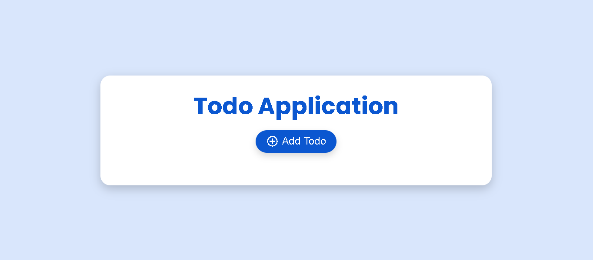
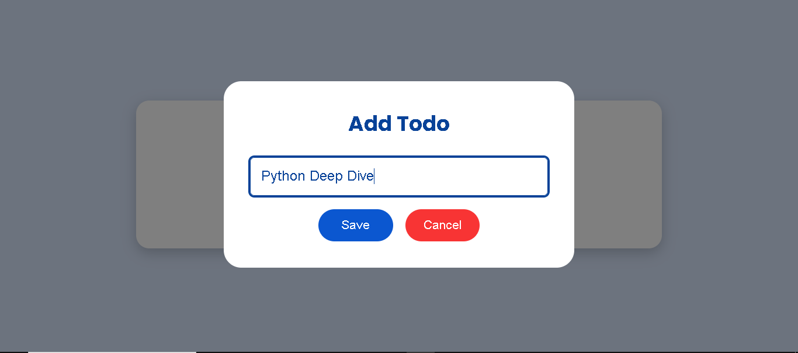
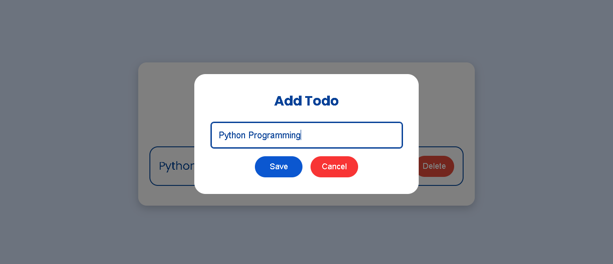
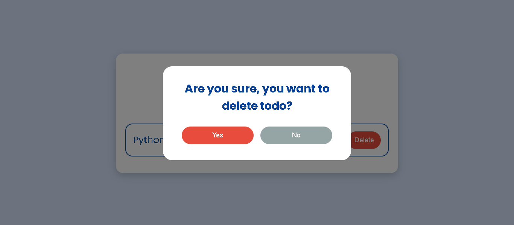
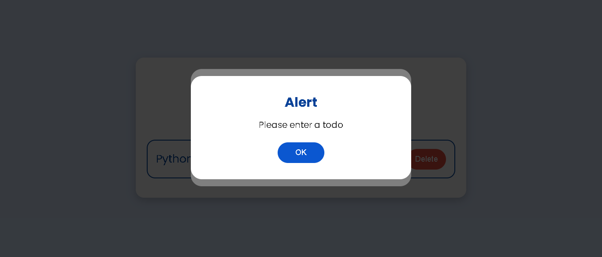

# 📝 **Todo Application**

Welcome to the **Todo Application**! This is a simple yet elegant Todo app built with **HTML**, **CSS**, and **JavaScript**. It allows you to add, edit, and delete tasks with custom popup dialogs that enhance user interaction. The app also uses the browser's **Local Storage** for data persistence, ensuring your tasks remain even after you close the browser.

🌟 **[Live Demo](https://hashimthepassionate.github.io/todo-application)**

## 📚 Table of Contents

- [✨ Features](#-features)
- [🚀 How to Use](#-how-to-use)
- [🛠️ Installation](#️-installation)
- [📷 Screenshots](#-screenshots)
  - [Main Interface](#main-interface)
  - [Add Todo Popup](#add-todo-popup)
  - [Edit Todo Popup](#edit-todo-popup)
  - [Delete Confirmation Popup](#delete-confirmation-popup)
  - [Alert Popup](#alert-popup)
- [🙏 Credits](#-credits)
- [📄 License](#-license)

## ✨ Features

- **Add New Todos** 📝
- **Edit Existing Todos** ✏️
- **Delete Todos with Confirmation** ❌
- **Custom Themed Popup Dialogs** 🎨
- **Persistent Data Storage with Local Storage** 💾
- **Responsive and Modern Design** 📱
- **Smooth Animations and Transitions** ✨

## 🚀 How to Use

1. **Clone or Download** the repository to your local machine:

   ```bash
   git clone https://github.com/HashimThePassionate/todo-application.git
   ```

2. Navigate to the project directory:

   ```bash
   cd todo-application
   ```

3. Open the `index.html` file in your web browser:

   ```bash
   open index.html
   ```

   Or simply double-click on the `index.html` file.

4. Start adding your tasks by clicking on the **Add Todo** button! 🎉

## 🛠️ Installation

No additional installations are required. The app is built using plain HTML, CSS, and JavaScript, and runs entirely in the browser.

## 📷 Screenshots

### Main Interface



### Add Todo Popup



### Edit Todo Popup



### Delete Confirmation Popup



### Alert Popup



## 🙏 Credits

- **Author**: [Muhammad Hashim](https://github.com/hashimthepassionate)
- **Fonts**:
  - 'Poppins' from [Google Fonts](https://fonts.google.com/)
  - 'Material Symbols Outlined' from [Google Fonts](https://fonts.google.com/icons)
- **Icons**:
  - Material Symbols provided by Google.
- **Inspiration**:
  - The desire to create a simple yet functional Todo app with a clean user interface.
- **Special Thanks**:
  - To all open-source contributors who inspire us to build and share.

## 📄 License

This project is licensed under the **MIT License** - see the [LICENSE](LICENSE) file for details.

---
